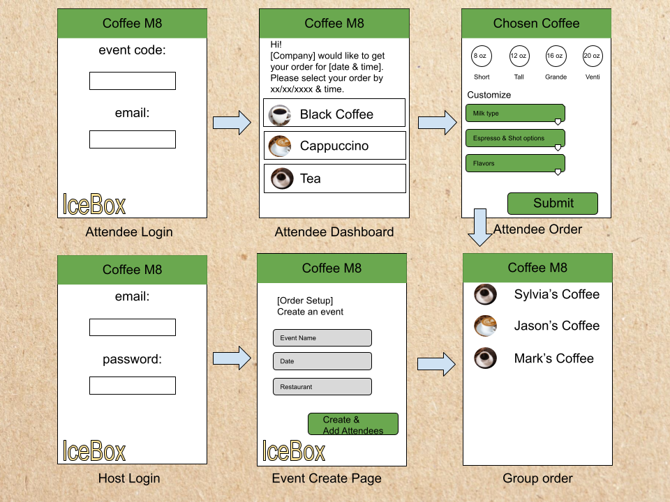

Coffe M8 - Simplifying group orders
--

It's 2022, gone are the days where we pass around a phone to make a group order (or a menu, or a pen and paper for that matter). 

Technologies used
--
* React 18
* Node Package Manager
* Express
* Embedded Java Script
* CSS3
* Javascript
* Mongoose
* MongoDB

Getting Started
--

App is under construction! Check out our [Trello Board](https://trello.com/b/iFW7IhrW/coffees).

Unsolved Problems
--
none

Future Enhancements
--
App is in production, stay tuned.
